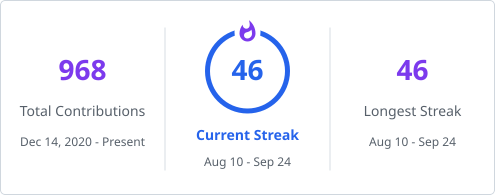

<!-- ════════════════════════════════════════════════════════════════ -->
<!--                         BANNER                                  -->
<!-- ════════════════════════════════════════════════════════════════ -->

<h1 align="center">Aditya N Bhandari</h1>

Software Engineering • Operating Systems • Distributed Systems

Computational Research • Machine Learning • Backend Development

<!-- ════════════════════════════════════════════════════════════════ -->
<!--                    ANIMATED TYPING SVG                          -->
<!-- ════════════════════════════════════════════════════════════════ -->

<!-- ════════════════════════════════════════════════════════════════ -->
<!--                      SOCIAL BADGES                              -->
<!-- ════════════════════════════════════════════════════════════════ -->

<!-- ════════════════════════════════════════════════════════════════ -->
<!--                     VISITOR COUNTER                             -->
<!-- ════════════════════════════════════════════════════════════════ -->

---

### Contribution Activity

<picture>
  <source
    media="(prefers-color-scheme: dark)"
    srcset="https://raw.githubusercontent.com/TheUnnamedOne-design/TheUnnamedOne-design/output/github-snake-dark.svg"
  />
  <source
    media="(prefers-color-scheme: light)"
    srcset="https://raw.githubusercontent.com/TheUnnamedOne-design/TheUnnamedOne-design/output/github-snake.svg"
  />
  
</picture>

---

<!-- ════════════════════════════════════════════════════════════════ -->
<!--                  LANGUAGE & SKILL BADGES                        -->
<!-- ════════════════════════════════════════════════════════════════ -->

### Languages & Skills

---

<!-- ════════════════════════════════════════════════════════════════ -->
<!--                       ABOUT ME                                  -->
<!-- ════════════════════════════════════════════════════════════════ -->

## About Me

- Fourth-year B.Tech Computer Science student at **VIT Chennai**.
- Passionate about **software engineering**, **operating systems**, **system design**, and **distributed systems**.
- **Published researcher** with interests spanning operating systems, graph theory, computational chemistry, and machine learning.
- Interested in research in **computational physics**, **computational chemistry**, and **predictive modelling**.
- Enjoy solving complex algorithmic problems and building **scalable backend systems**.
- Build **full-stack applications** that combine robust backend architecture with functional frontends.
- Always exploring new technologies across systems programming, distributed computing, and research.
- Believe in combining **research-driven insights** with **practical engineering** to build reliable software.

---

<!-- ════════════════════════════════════════════════════════════════ -->
<!--                   FEATURED TECHNOLOGIES                         -->
<!-- ════════════════════════════════════════════════════════════════ -->

## Featured Technologies

<b>Languages</b>

 

<b>Frameworks & Libraries</b>

 

<b>Databases</b>

 

<b>Tools & Platforms</b>

 

---
## GitHub Analytics

<!-- GitHub Streak -->
<picture>
  <source
    media="(prefers-color-scheme: dark)"
    srcset="./profile/streak-dark.svg"
  />
  <source
    media="(prefers-color-scheme: light)"
    srcset="./profile/streak-light.svg"
  />
  
</picture>

  

<!-- GitHub Statistics -->
<picture>
  <source
    media="(prefers-color-scheme: dark)"
    srcset="https://github-readme-stats-3h14.vercel.app/api?username=TheUnnamedOne-design&show_icons=true&hide_border=true&count_private=true&rank_icon=github&bg_color=0D1117&title_color=58A6FF&text_color=8B949E&icon_color=A371F7"
  />
  <source
    media="(prefers-color-scheme: light)"
    srcset="https://github-readme-stats-3h14.vercel.app/api?username=TheUnnamedOne-design&show_icons=true&hide_border=true&count_private=true&rank_icon=github&bg_color=FFFFFF&title_color=2563EB&text_color=57606A&icon_color=7C3AED"
  />
  
</picture>

&nbsp;

<!-- Top Languages -->
<picture>
  <source
    media="(prefers-color-scheme: dark)"
    srcset="https://github-readme-stats-3h14.vercel.app/api/top-langs/?username=TheUnnamedOne-design&layout=compact&hide_border=true&langs_count=8&bg_color=0D1117&title_color=58A6FF&text_color=8B949E"
  />
  <source
    media="(prefers-color-scheme: light)"
    srcset="https://github-readme-stats-3h14.vercel.app/api/top-langs/?username=TheUnnamedOne-design&layout=compact&hide_border=true&langs_count=8&bg_color=FFFFFF&title_color=2563EB&text_color=57606A"
  />
  
</picture>

<!-- ════════════════════════════════════════════════════════════════ -->
<!--                    FEATURED PROJECTS                            -->
<!-- ════════════════════════════════════════════════════════════════ -->

## Featured Projects

<b>EncryptedA2AProtocol — Encrypted Agent-to-Agent Communication Protocol</b>

 

**Repository:** [TheUnnamedOne-design/EncryptedA2AProtocol](https://github.com/TheUnnamedOne-design/EncryptedA2AProtocol)

**Description:**
Encrypted Agent-to-Agent communication protocol inspired by Google's A2A architecture. Implements secure PKI-based trust establishment enabling authenticated distributed communication between agents.

**Technology Stack:**

**Key Highlights:**
- RSA-2048 identity generation with Certificate Authority and certificate validation
- Mutual authentication and hybrid RSA + AES encryption per session
- Secure peer discovery with distributed architecture over HTTPS
- Extensible modular architecture designed for scale

---

<b>Broker Copilot — Insurance Renewal Orchestration Assistant</b>

 

**Repository:** [TheUnnamedOne-design/Broker_Copilot](https://github.com/TheUnnamedOne-design/Broker_Copilot)

**Description:**
AI-powered insurance renewal orchestration assistant built on a connector-first architecture. No RAG, no embeddings — real-time synthesis directly from Outlook and CRM data.

**Technology Stack:**

**Key Highlights:**
- Real-time Outlook integration with AI-generated email drafts
- Executive renewal briefs and intelligent client prioritization
- Smart filtering and interactive AI assistant interface

---

<b>ChronoSeal — Blockchain Time Capsule Application</b>

 

**Description:**
A decentralized time capsule application built on Ethereum. Users can seal messages and assets into smart contracts that unlock only after a specified time — immutable, verifiable, and trustless.

**Technology Stack:**

**Key Highlights:**
- Time-locked capsules via smart contracts with immutable blockchain storage
- Gas-optimized contract design with security auditing
- React-based frontend for capsule creation and management

---

<b>ArchViNet — Enterprise Real-Time Collaboration Platform</b>

 

**Description:**
An enterprise-grade real-time collaboration platform with integrated network topology visualization. Designed for teams that need both structured communication and live infrastructure insight.

**Technology Stack:**

**Key Highlights:**
- Real-time messaging with private channels and persistent chat history
- Live network topology visualization and role-based permission management
- Responsive interface designed for enterprise scale

---

<!-- ════════════════════════════════════════════════════════════════ -->
<!--                      PUBLICATIONS                               -->
<!-- ════════════════════════════════════════════════════════════════ -->

## Publications

<b>Flexible Queue Scheduling: A Context Switching–Aware CPU Scheduling Algorithm</b>

 

**Conference:** 2026 Third International Conference on Networking and Communications (ICNWC)

**Publisher:** IEEE

**Authors:** Aditya Narayan Bhandari · Chebolu Tarun · M. Sivagami

---

<b>Predictive Modeling and Ranking of Physicochemicals in Aegle marmelos using Topological Indices and Multi-Criteria Decision-Making Techniques</b>

 

**Journal:** Frontiers in Chemistry

**Authors:** Aditya Narayan Bhandari · Jaganathan B

---

<!-- ════════════════════════════════════════════════════════════════ -->
<!--                  COMPETITIVE PROGRAMMING                        -->
<!-- ════════════════════════════════════════════════════════════════ -->

## Competitive Programming

&nbsp;

- Active problem solver with consistent practice across LeetCode and Codeforces.
- Primary focus: **Data Structures & Algorithms** — graphs, trees, dynamic programming, and systems-oriented problems.

---

<!-- ════════════════════════════════════════════════════════════════ -->
<!--                    CURRENT LEARNING                             -->
<!-- ════════════════════════════════════════════════════════════════ -->

## Currently Exploring

---

<!-- ════════════════════════════════════════════════════════════════ -->
<!--                    AREAS OF INTEREST                            -->
<!-- ════════════════════════════════════════════════════════════════ -->

## Areas of Interest

| Domain | Focus |
|---|---|
| Software Engineering | Scalable systems, clean architecture, backend development |
| Operating Systems | Scheduling, memory management, kernel internals |
| Distributed Systems | Consensus protocols, fault tolerance, distributed storage |
| Machine Learning | Predictive modelling, applied ML, model optimization |
| Graph Theory | Topological indices, graph algorithms, combinatorics |
| Computational Research | Computational chemistry, computational physics, simulations |
| Backend Development | REST APIs, microservices, performance engineering |
| Research | Interdisciplinary research combining CS and applied sciences |

---

<!-- ════════════════════════════════════════════════════════════════ -->
<!--                     CONNECT WITH ME                             -->
<!-- ════════════════════════════════════════════════════════════════ -->

## Connect With Me

&nbsp;

&nbsp;

&nbsp;

---

<!-- ════════════════════════════════════════════════════════════════ -->
<!--                    CONTRIBUTION SNAKE                           -->
<!--  The snake SVG is generated by a GitHub Actions workflow.       -->
<!--  After adding the workflow below, it renders automatically.     -->
<!-- ════════════════════════════════════════════════════════════════ -->

---

<!-- ════════════════════════════════════════════════════════════════ -->
<!--                        FOOTER                                   -->
<!-- ════════════════════════════════════════════════════════════════ -->

*Building reliable software systems through engineering, research, and continuous learning.*

